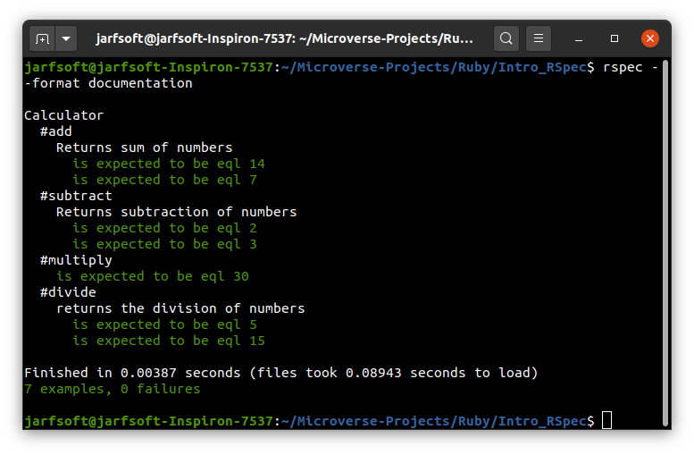

# Introduction to RSpec

# A project made to test Rspec framework in ruby to make TDD

## Built With

- Ruby
- Rspec

## Getting started
In order to run the project locally clone the repository 

    git clone https://github.com/marcelomaidden/ruby_testing
    
Enter the directory

    cd ruby_testing

Install gem package

    gem install rspec

Run tests and see the results

    rspec --profile --format documentation

## Author

**Juan Raudales**

- GitHub: [@Jarfsoft](https://github.com/Jarfsoft)
- Twitter: [@Jarfsoft](https://twitter.com/Jarfsoft)
- LinkedIn: [Juan Andrés Raudales Flores](https://www.linkedin.com/in/juan-raudales-flores-7b0a3b113/)

## Acknowledgements
- Ruby creators
- Rspec creators

##  Contributing

Contributions, issues, and feature requests are welcome!

## Show your support

Give a ⭐️ if you like this project!
